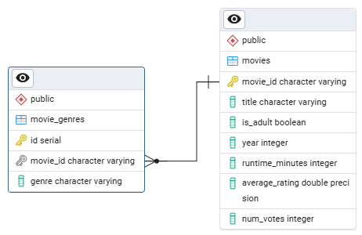

# 🎬 IMDB Movies ETL Pipeline

A simple, end‑to‑end Extract‑Transform‑Load (ETL) pipeline that ingests raw IMDb data, cleans and transforms it with Pandas, and loads it into a PostgreSQL database via SQLAlchemy. It splits out movies and their genres into two normalized tables for easy querying and BI integration.

---

## 📁 Repository Structure

```
.
├── .gitattributes
├── .gitignore
├── ETL file.ipynb        ← Jupyter notebook with the full ETL workflow
├── README.md             ← This file
└── requirements.txt      ← Python dependencies
```

---

## ⚙️ Prerequisites & Setup

1. **Clone this repo**

   ```bash
   git clone https://github.com/your‑username/movie‑etl‑pipeline.git
   cd movie‑etl‑pipeline
   ```

2. **Create & activate a virtual environment**

   ```bash
   python -m venv venv
   source venv/bin/activate      # macOS/Linux
   venv\Scripts\activate       # Windows
   ```

3. **Install dependencies**

   ```bash
   pip install -r requirements.txt
   ```

4. **Configure your PostgreSQL connection**\
   In the notebook’s first code cell, update the `create_engine(...)` URL to match your database:

   ```python
   engine = create_engine(
     "postgresql://<username>:<password>@<host>:<port>/<database>"
   )
   ```

---

## 🗺️ ETL Workflow Overview

1.

   ### 📥 Extract

   - Load IMDb TSV files from: [IMDb Datasets](https://www.imdb.com/interfaces/)
      - `title.basics.tsv.gz` (movie metadata)
      - `title.ratings.tsv.gz` (user ratings)

2.

   ### 🧹 Transform

   - **Clean nulls** (`\N` → `NaN` → `None`)
   - **Convert types**: years → integers, ratings → floats, votes → big integers
   - **Filter** to only `"movie"` entries
   - **Normalize** genres: explode the list of genres into separate rows

3.

   ### 🗃️ Schema Definition

   - `` table via SQLAlchemy ORM
     - `movie_id` (TEXT, PK)
     - `title` (TEXT)
     - `is_adult` (BOOLEAN)
     - `year` (INTEGER)
     - `runtime_minutes` (INTEGER)
     - `average_rating` (FLOAT)
     - `num_votes` (BIGINT)
   - `` table via SQLAlchemy ORM
     - `id` (SERIAL, PK)
     - `movie_id` (TEXT, FK → `movies.movie_id`)
     - `genre` (TEXT)

4.

   ### 💾 Load

   - Recreate tables with `Base.metadata.create_all(engine)`
   - Bulk‑insert `movies` and `movie_genres` DataFrames using `df.to_sql(..., method='multi')`

---

## 🛠️ How to Run

1. Launch Jupyter Notebook:
   ```bash
   jupyter notebook
   ```
2. Open and **run all cells** in `` from top to bottom.
3. Confirm in your PostgreSQL client (e.g. pgAdmin) that:
   - `movies` table contains all records
   - `movie_genres` table contains the exploded genres

---

## 🔍 Database Schema



### **movies**

| Column            | Type    | Description                    |
| ----------------- | ------- | ------------------------------ |
| `movie_id`        | TEXT    | IMDb title identifier (tconst) |
| `title`           | TEXT    | Movie’s primary title          |
| `is_adult`        | BOOLEAN | Adult‑only flag                |
| `year`            | INTEGER | Release year                   |
| `runtime_minutes` | INTEGER | Duration (minutes)             |
| `average_rating`  | FLOAT   | IMDb user rating (0–10)        |
| `num_votes`       | INT     | Number of votes                |

### **movie\_genres**

| Column     | Type   | Description                      |
| ---------- | ------ | -------------------------------- |
| `id`       | SERIAL | Auto‑incrementing primary key    |
| `movie_id` | TEXT   | Foreign key → `movies.movie_id`  |
| `genre`    | TEXT   | Single genre (one row per genre) |

---

## 📦 Dependencies

All required packages are listed in `` (install with `pip install -r requirements.txt`):

- pandas
- numpy
- SQLAlchemy
- psycopg2‑binary
- Jupyter (for notebook)

---

## 📝 .gitignore

```gitignore
# Python
__pycache__/
*.py[cod]

# Jupyter
.ipynb_checkpoints/

# Virtual environments
.venv/
venv/

# Misc
*.log
```

---

## 👤 Author

Hen Zrihen

---

## 📄 License

This project is licensed under the MIT License. See [LICENSE](LICENSE) for details.

